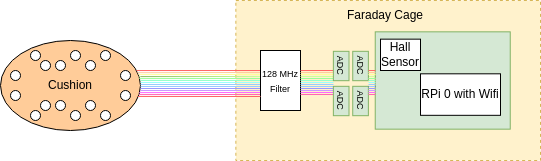
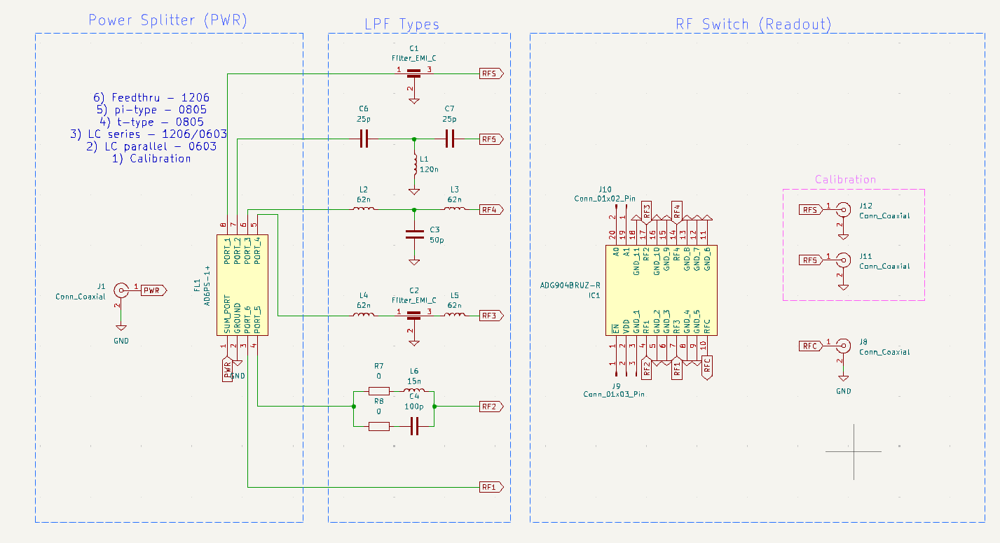

# MRI-Cushion
Real-time head tracking sensor in MRI 

## Schematic

Figure 1. Cushion schematic.

The cushion system is designed to work inside the MRI during scans. The head cushion is placed underneath the paiten's head and is equipped with 11 pressure sensors and 2 temperature sensors distributed evenly along the head's contour. The sensors are connected to 4 ADCs and a Raspberry Pi 0 situated inside a Faraday cage. All devices are modified by removing all magnetic components. A lowpass filter tuned to 128MHz (the Larmor frequency at 3T) filters EMI signals attacking the sensor to ADC lines. The pressure and temperature data are transmitted over a 2.4GHz wifi module which works due to the Faraday cage being leaky.

## Lowpass Filter Testing

Work is being done to find the best lowpass filter (LPF) that will signal the 13 lines carrying data. There are several contendors for a LPF, feedthrough capacitor, T-type, Pi-type, etc. To find the best design, we fabricated an RF PCB with different configurations.

Figure 2. Testboard schematic. An RF signal generated by a spectrum analyzer will be split into 6 traces carrying the same magnitude and 0 degree phase. Each trace has its own LPF configuration. An RF multiplexer reads one trace at a time. 

To test the filter, two spectrum analyzers are used to corroborate the effect of each filter. A HP-8712C and a NanoVNA are used. The test protocol is as follows:

1) Calibrate the SA with the empty trace (bottom most trace) to account for losses induced by the RF splitter, PCB, and RF multiplexer

2) Read each trace by enabling different logic states on the multiplexer IC. 

3) Record the frequency response and impedance from the range 40Mhz-200Mhz which is the range of Lamor frequencies at different field strength settings: 1T, 1.5T, and 3T. 

4) Follow steps 1-3, for DC frequency range of 1Hz-10KHz

### Analysis

The ideal frequency response would show a notch or lowpass filter near 128Mhz. The attenuation should be around -40 decibels or more. The complex impedance would also show a phase shift of -90 degrees indicating the filter is seen as an open circuit at 128MHz. 

## Data Transmission

## Data Processing

## Data incorporation