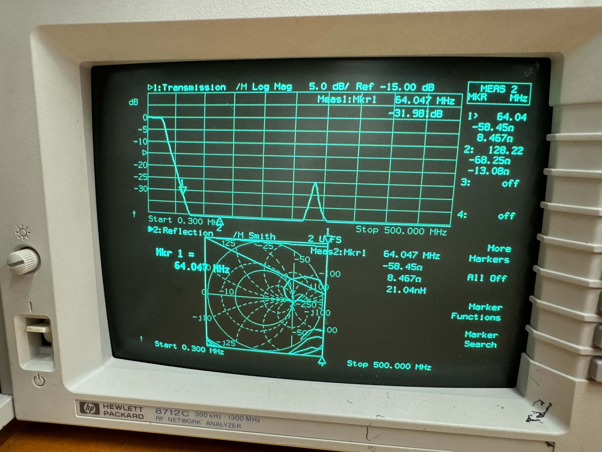

# MRI-Cushion
Real-time head tracking sensor in MRI 

## Schematic

    
Figure 1. Cushion schematic.

The cushion system is designed to work inside the MRI during scans. The head cushion is placed underneath the paiten's head and is equipped with 11 pressure sensors and 2 temperature sensors distributed evenly along the head's contour. The sensors are connected to 4 ADCs and a Raspberry Pi 0 situated inside a Faraday cage. All devices are modified by removing all magnetic components. A lowpass filter tuned to 128MHz (the Larmor frequency at 3T) filters EMI signals attacking the sensor to ADC lines. The pressure and temperature data are transmitted over a 2.4GHz wifi module which works due to the Faraday cage being leaky.

## Lowpass Filter Testing

Work is being done to find the best lowpass filter (LPF) that will protect the 13 lines carrying data. There are several contendors for a LPF: feedthrough capacitor, T-type, Pi-type, etc. To find the best design, we fabricated an RF PCB with different configurations.

    
Figure 2. Testboard schematic. An RF signal generated by a VNA will be split into 6 traces carrying the same magnitude and 0 degree phase. Each trace has its own LPF configuration. An RF switch reads one trace at a time. 

To test the filter, two VNAs are used to corroborate the effect of each filter. A HP-8712C and a NanoVNA are used. The test protocol is as follows:

1) Calibrate the SA with the empty trace (bottom most trace) to account for losses induced by the RF splitter, PCB, and RF switch.

2) Read each trace by enabling different logic states on the multiplexer IC. 

3) Record the frequency response and impedance from the range 40Mhz-200Mhz which is the range of Lamor frequencies at different field strength settings: 1T, 1.5T, and 3T. 

4) Follow steps 1-3, for DC frequency range of 1Hz-10KHz.

## NanoVNA Results Analysis:

### CH0/CH1 - Log magnitude of the input reflection coefficient

The Log Magnitude of Input Reflection Coefficient for channel S11 and S21 have different meanings. S11 measures how much the signal is reflected back from the filter's input. S21 measures how much of the signal is transmitted through the filter's input. 

  Ideal Behavior: 

  1) S11 should have a very low reflection coefficient (in the negatives) for the passband. In the stopband, it should have a high, positive magnitude.

  2) S21 should be ~0dB in the passband, and very negative in the stopband

### Smith chart of the complex impedance

A visual representation of the filter's impedance as a function of frequency. R +jX shows the resistive and complex impedance. Useful for impedance matching.

  Ideal Behavior:

  1) In the passband, it should have ~50ohm and very little complex impedance. In the stopband, the resistive and complex impedance should deviate significantly.  

5th order T-Type

## ToDo

2) Run simulations of all possible configurations with LTSpice

3) Setup Arduino for RF switching: Mfr #: ADG904BRUZ-R, datasheet: 

## Data Transmission

## Data Processing

## Data Incorporation